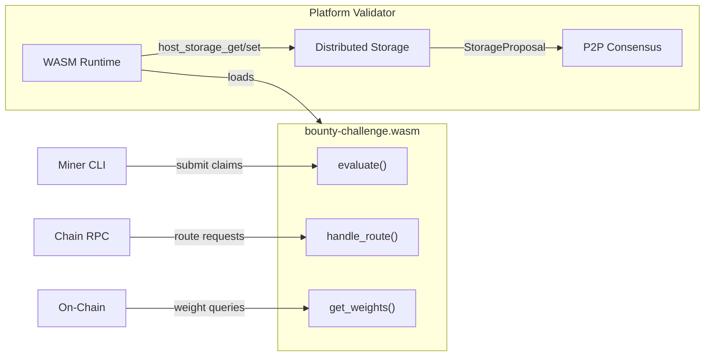

<div align="center">

# bουηtү chαllεηgε

**Decentralized Bug Bounty Protocol — Earn TAO by Improving Open Source Software**

[](https://github.com/PlatformNetwork/bounty-challenge/actions/workflows/ci.yml)
[](https://github.com/PlatformNetwork/bounty-challenge/blob/main/LICENSE)
[](https://github.com/PlatformNetwork/bounty-challenge/stargazers)
[](https://www.rust-lang.org/)


</div>

Bounty Challenge is a WASM evaluation module for [Platform Network](https://github.com/PlatformNetwork/platform). Miners earn rewards by discovering and reporting valid GitHub issues. Issues must be closed with the `valid` label by project maintainers to qualify for rewards.

> **IMPORTANT**: To receive rewards, you MUST submit issues in **this repository** ([PlatformNetwork/bounty-challenge](https://github.com/PlatformNetwork/bounty-challenge/issues)). Issues submitted directly to other repositories will **NOT** be counted for rewards.

## How to Mine

### 1. Install the CLI

```bash
# Download the latest release
platform download bounty-cli

# Or build from source
cargo build --release -p bounty-cli
```

### 2. Launch the Interactive CLI

```bash
# Set validator RPC URL (optional, defaults to localhost:8080)
export BOUNTY_RPC_URL=http://VALIDATOR_IP:8080

# Launch interactive TUI
bounty-cli
```

The CLI provides an interactive menu with live dashboards:

```
  bounty-challenge
  RPC: http://localhost:8080

? Select an action ›
❯ Leaderboard        (live dashboard)
  Challenge Stats    (live dashboard)
  Weights            (live dashboard)
  My Status
  Issues
  Pending Issues
  Register
  Claim Bounty
  Change RPC URL
  Quit
```

### 3. Register Your Hotkey

Select **Register** from the menu and follow the prompts:
- Enter your SS58 hotkey
- Enter your GitHub username
- Provide your signature and timestamp

The signature is created by signing `register_github:{username_lowercase}:{timestamp}` with your sr25519 hotkey.

### 4. Find and Report Issues

1. Discover valid bugs or issues in eligible repositories
2. Submit the issue in **this repository** ([PlatformNetwork/bounty-challenge](https://github.com/PlatformNetwork/bounty-challenge/issues))
3. Wait for project maintainers to review and close the issue with the `valid` label

### 5. Claim Your Bounty

Select **Claim Bounty** from the menu and enter the issue numbers you want to claim.

### 6. Track Your Progress

Use the live dashboards to monitor:
- **Leaderboard**: Real-time rankings with scores
- **Challenge Stats**: Total bounties, active miners, validator count
- **Weights**: Current weight assignments for rewards
- **My Status**: Your registration, valid/invalid issues, and weight

## CLI Features

| Feature | Description |
|---------|-------------|
| **Live Dashboards** | Auto-refreshing leaderboard, stats, and weights views |
| **Interactive Registration** | Guided hotkey + GitHub registration |
| **Claim Management** | Easy bounty claiming interface |
| **Issue Browser** | View all synced and pending issues |
| **RPC Switcher** | Change validator endpoint on the fly |

## Architecture

This project is a `#![no_std]` Rust crate compiled to `wasm32-unknown-unknown`. It implements the `Challenge` trait from [`platform-challenge-sdk-wasm`](https://github.com/PlatformNetwork/platform/tree/main/crates/challenge-sdk-wasm) and runs inside the Platform Network validator runtime.



### Key Features

- **WASM Module**: Runs inside the validator's sandboxed WASM runtime
- **Distributed Storage**: State replicated across validators via P2P consensus
- **Platform Consensus**: Storage writes go through StorageProposal/Vote system
- **Weight Calculation**: Normalized weight assignments for on-chain rewards
- **Chain RPC Routes**: Leaderboard, stats, registration, claims, and more

## Building

```bash
# Install WASM target (one-time)
rustup target add wasm32-unknown-unknown

# Build the WASM module
cargo build --release --target wasm32-unknown-unknown

# Output: target/wasm32-unknown-unknown/release/bounty_challenge.wasm

# Build the CLI
cargo build --release -p bounty-cli
```

## Reward System

### Point System

| Source | Points | Description |
|--------|--------|-------------|
| **Valid Issue** | 1 point | Issue closed with `valid` label |
| **Starred Repo** | 0.25 points | Each starred target repository |

### Weight Calculation

```
weight = net_points × 0.02
```

Where:
- `net_points = valid_count + star_bonus - penalty`
- Weights are normalized to sum to 1.0 across all miners

### Penalty System

| Rule | Description |
|------|-------------|
| **Invalid Penalty** | max(0, invalid_count - valid_count) |
| **Duplicate Penalty** | max(0, duplicate_count - valid_count) |
| **Zero Weight** | If net points ≤ 0, weight = 0 |

## API Routes

Routes are served through the Platform Network validator RPC at `/challenge/bounty-challenge/<path>`:

| Method | Path | Auth | Description |
|--------|------|------|-------------|
| GET | `/leaderboard` | No | Current standings |
| GET | `/stats` | No | Challenge statistics |
| GET | `/status/:hotkey` | No | Hotkey status and balance |
| POST | `/register` | Yes | Register GitHub username |
| POST | `/claim` | Yes | Claim bounty for issues |
| GET | `/issues` | No | List all synced issues |
| GET | `/issues/pending` | No | List pending issues |
| GET | `/hotkey/:hotkey` | No | Detailed hotkey info |
| POST | `/issues/sync` | Yes | Sync issue data |
| GET | `/get_weights` | No | Weight assignments |

## Project Structure

```
bounty-challenge/
├── Cargo.toml               # Workspace config
├── bins/
│   └── bounty-cli/          # Interactive CLI
│       ├── src/
│       │   ├── main.rs      # TUI menu
│       │   ├── rpc.rs       # RPC client
│       │   ├── tui/         # Live dashboards
│       │   └── views/       # Interactive views
├── src/
│   ├── lib.rs               # Challenge trait impl
│   ├── types.rs             # Domain types
│   ├── scoring.rs           # Weight calculation
│   ├── validation.rs        # Issue validation
│   ├── routes.rs            # Route definitions
│   ├── api/handlers.rs      # Route handlers
│   └── storage/             # Host storage
└── docs/                    # Documentation
```

## Development

```bash
# Format code
cargo fmt

# Lint (must target wasm32)
cargo clippy --target wasm32-unknown-unknown

# Check compilation
cargo check --target wasm32-unknown-unknown

# Build CLI only
cargo build -p bounty-cli
```

## Anti-Abuse Mechanisms

| Mechanism | Description |
|-----------|-------------|
| **Valid Label Required** | Only issues closed with `valid` label count |
| **Signature Verification** | sr25519 signature proves hotkey ownership |
| **Author Verification** | GitHub username must match issue author |
| **First Reporter Wins** | Each issue can only be claimed once |
| **Platform Consensus** | Storage writes require validator majority |
| **Label Protection** | GitHub Actions prevent unauthorized label changes |

## Documentation

- **For Miners:**
  - [Getting Started](docs/miner/getting-started.md)
  - [Registration Guide](docs/miner/registration.md)

- **Reference:**
  - [Scoring & Rewards](docs/reference/scoring.md)
  - [API Reference](docs/reference/api-reference.md)
  - [Anti-Abuse Mechanisms](docs/anti-abuse.md)

## License

Apache-2.0
