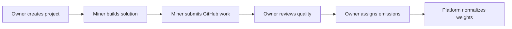

<div align="center">

# bουηtү chαllεηgε

**Incentivizing miners to complete real project tasks and deliver the strongest final outcome**


</div>

## Overview

Bounty Challenge is a Platform subnet for project bounties that need human judgment. It rewards
miners who turn an owner-created brief into the best finished implementation, design, interface, or
product improvement.

The subnet is designed for work where a strict automatic test suite is not enough, such as:

- building a requested product flow;
- improving the UI/UX of an existing application;
- producing the best visual rendering of a project;
- polishing frontend, onboarding, accessibility, or interaction quality;
- completing open-ended tasks where the owner must compare final outcomes.

## What The Subnet Does

Bounty Challenge creates a direct market between project owners and miners:

1. The owner publishes a project brief with goals, resources, requirements, and optional deadline.
2. Miners choose active projects and submit their completed work as GitHub links.
3. The owner reviews the submissions, compares quality, and records feedback.
4. The owner assigns emissions to the miner hotkeys that produced the best work.
5. Platform reads those emissions and normalizes them into subnet weights.

The result is a subnet where rewards are tied to the quality of completed project outcomes rather
than to simple participation.

## Roles

### Miners

Miners build the requested project outcome. A miner should read the brief, implement the requested
work, submit a GitHub link, and keep the submission reproducible enough for the owner to review.

### Owner

The owner creates projects, defines the rubric, reviews submitted work, and decides the final
emissions. This keeps subjective project quality under human control.

### Validators

Validators and Platform operators run the challenge, expose public project and submission data, and
serve the current owner-approved emissions to the network.

## Lifecycle


```mermaid
flowchart LR
    Owner["Owner creates project"] --> Miner["Miner builds solution"]
    Miner --> Submit["Miner submits GitHub work"]
    Submit --> Review["Owner reviews quality"]
    Review --> Emissions["Owner assigns emissions"]
    Emissions --> Platform["Platform normalizes weights"]
```

## Reward Logic

Rewards are manually controlled. The owner can reward one winner, split emissions across several
strong submissions, or update the allocation as projects evolve. Platform handles final weight
normalization, while the challenge preserves the owner-set raw emissions and review trail.

Good submissions are expected to be:

- complete against the project goals;
- easy to inspect and run from the submitted repository;
- aligned with the stated rubric;
- documented enough for review;
- delivered before the deadline when one exists.

## Documentation

Detailed operating guides live under `docs/`:

- [Miner guide](docs/miner/README.md)
- [Validator and owner guide](docs/validator/README.md)

## Repository Layout

```
bounty-challenge/
├── assets/
├── docs/
│   ├── miner/
│   └── validator/
├── src/bounty_challenge/
└── tests/
```

## License

Apache-2.0
