<div align="center">

# bουηtү chαllεηgε

**GitHub Issue Reward System for Platform Network**

[](https://github.com/PlatformNetwork/bounty-challenge/actions/workflows/ci.yml)
[](https://github.com/PlatformNetwork/bounty-challenge/blob/main/LICENSE)
[](https://github.com/PlatformNetwork/bounty-challenge/stargazers)
[](https://www.rust-lang.org/)


</div>

Bounty Challenge is a WASM evaluation module for [Platform Network](https://github.com/PlatformNetwork/platform-v2). Miners earn rewards by discovering and reporting valid GitHub issues. Issues must be closed with the `valid` label by project maintainers to qualify for rewards.

> **IMPORTANT**: To receive rewards, you MUST submit issues in **this repository** ([PlatformNetwork/bounty-challenge](https://github.com/PlatformNetwork/bounty-challenge/issues)). Issues submitted directly to other repositories will **NOT** be counted for rewards.

## Architecture

```mermaid
flowchart LR
    subgraph Validator["Platform Validator"]
        Runtime["WASM Runtime"]
        Storage["Host Storage"]
        Runtime -->|"host_storage_get/set"| Storage
    end
    
    subgraph Module["bounty-challenge.wasm"]
        Evaluate["evaluate()"]
        Routes["handle_route()"]
        Weights["get_weights()"]
    end
    
    Runtime -->|"loads"| Module
    Miner["🧑‍💻 Miner"] -->|"submit claims"| Evaluate
    API["HTTP API"] -->|"route requests"| Routes
    Chain["On-Chain"] -->|"weight queries"| Weights
```

This project is a `#![no_std]` Rust crate compiled to `wasm32-unknown-unknown`. It implements the `Challenge` trait from [`platform-challenge-sdk-wasm`](https://github.com/PlatformNetwork/platform-v2/tree/main/crates/challenge-sdk-wasm) and runs inside the Platform Network validator runtime.



### Key Features

- **WASM Module**: Runs inside the validator's sandboxed WASM runtime
- **On-Chain Storage**: All state persisted via host-provided key/value storage
- **Validator Consensus**: Multi-validator agreement on issue validity and sync data
- **Weight Calculation**: Normalized weight assignments for on-chain rewards
- **HTTP Routes**: Leaderboard, stats, registration, claims, and more

## Building

```bash
# Install WASM target (one-time)
rustup target add wasm32-unknown-unknown

# Build the WASM module
cargo build --release --target wasm32-unknown-unknown

# Output: target/wasm32-unknown-unknown/release/bounty_challenge.wasm
```

## Reward System

### Point System

| Source | Points | Description |
|--------|--------|-------------|
| **Valid Issue** | 1 point | Issue closed with `valid` label |
| **Starred Repo** | 0.25 points | Each starred target repository |

### Weight Calculation

$$W_{user} = net\_points \times 0.02$$

Where:
- `net_points = valid_count + star_bonus - penalty`
- Weights are normalized to sum to 1.0 across all miners

### Penalty System

| Rule | Description |
|------|-------------|
| **Invalid Penalty** | max(0, invalid_count - valid_count) |
| **Duplicate Penalty** | max(0, duplicate_count - valid_count) |
| **Zero Weight** | If net points ≤ 0, weight = 0 |

## API Routes

All routes are served through the Platform Network validator bridge.

| Method | Path | Auth | Description |
|--------|------|------|-------------|
| GET | `/leaderboard` | No | Current standings |
| GET | `/stats` | No | Challenge statistics |
| GET | `/status/:hotkey` | No | Hotkey status and balance |
| POST | `/register` | Yes | Register GitHub username with hotkey |
| POST | `/claim` | Yes | Claim bounty for resolved issues |
| GET | `/issues` | No | List all synced issues |
| GET | `/issues/pending` | No | List pending issues |
| GET | `/hotkey/:hotkey` | No | Detailed hotkey information |
| POST | `/invalid` | Yes | Record an invalid issue |
| POST | `/sync/propose` | Yes | Propose synced issue data |
| GET | `/sync/consensus` | No | Check sync consensus status |
| POST | `/issue/propose` | Yes | Propose issue validity |
| POST | `/issue/consensus` | No | Check issue validity consensus |
| GET | `/config/timeout` | No | Get timeout configuration |
| POST | `/config/timeout` | Yes | Update timeout configuration |
| GET | `/get_weights` | No | Normalized weight assignments |

## Project Structure

```
bounty-challenge/
├── Cargo.toml               # WASM crate config (cdylib + rlib)
├── src/
│   ├── lib.rs               # Challenge trait implementation
│   ├── types.rs             # Domain types
│   ├── scoring.rs           # Weight calculation
│   ├── consensus.rs         # Validator consensus
│   ├── validation.rs        # Issue validation and claims
│   ├── routes.rs            # Route definitions and dispatch
│   ├── api/
│   │   └── handlers.rs      # Route handlers
│   └── storage/
│       └── bounty_storage.rs # Host key/value storage
├── docs/                    # Documentation
└── .github/workflows/       # CI configuration
```

## Development

```bash
# Format code
cargo fmt

# Lint (must target wasm32)
cargo clippy --target wasm32-unknown-unknown

# Check compilation
cargo check --target wasm32-unknown-unknown
```

## Anti-Abuse Mechanisms

| Mechanism | Description |
|-----------|-------------|
| **Valid Label Required** | Only issues closed with `valid` label count |
| **Signature Verification** | sr25519 signature proves hotkey ownership |
| **Author Verification** | GitHub username must match issue author |
| **First Reporter Wins** | Each issue can only be claimed once |
| **Validator Consensus** | Multiple validators must agree on issue validity |
| **Label Protection** | GitHub Actions prevent unauthorized label changes |

## Documentation

- **For Miners:**
  - [Getting Started](docs/miner/getting-started.md)
  - [Registration Guide](docs/miner/registration.md)

- **For Validators:**
  - [Setup Guide](docs/validator/setup.md)

- **Reference:**
  - [Scoring & Rewards](docs/reference/scoring.md)
  - [API Reference](docs/reference/api-reference.md)
  - [Anti-Abuse Mechanisms](docs/anti-abuse.md)

## Acknowledgments

- [Cortex Foundation](https://github.com/CortexLM) for the Cortex ecosystem
- [Platform Network](https://github.com/PlatformNetwork) for the challenge SDK
- [Bittensor](https://bittensor.com/) for the decentralized AI network

## License

Apache-2.0
