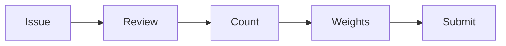

# Scoring & Rewards

Complete specification of the adaptive reward system for Bounty Challenge.

## Table of Contents

1. [Overview](#overview)
2. [Emission Rate](#emission-rate)
3. [Adaptive Weight Calculation](#adaptive-weight-calculation)
4. [User Weight](#user-weight)
5. [Bittensor Integration](#bittensor-integration)
6. [Examples](#examples)
7. [Configuration](#configuration)

---

## Overview

Bounty Challenge uses an **adaptive reward system** designed to:
1. **Incentivize participation** - More issues = more total emissions
2. **Prevent gaming** - Adaptive weights prevent spam attacks
3. **Ensure fairness** - Rewards scale with contribution
4. **Encourage quality** - Only validated issues count

### Key Principles

| Principle | Implementation |
|-----------|---------------|
| **Activity-Based Emission** | 250 issues/day = full emission |
| **Adaptive Per-Issue Weight** | Weight decreases when activity > 100/day |
| **Rolling Window** | Only last 24 hours count |
| **Quality Gate** | Maintainers must add `valid` label |

---

## Emission Rate

### Maximum Daily Emission

The maximum available weight depends on total daily activity:

$$W_{max} = \min\left(\frac{N_{total}}{250}, 1.0\right)$$

Where:
- $W_{max}$ = Maximum total weight available for distribution
- $N_{total}$ = Total valid issues in the last 24 hours
- 250 = Target issues per day for full emission

### Emission Curve

```
Weight
  │
1.0├────────────────────────────────●────────────────
   │                          ●
0.8├                    ●
   │              ●
0.6├        ●
   │    ●
0.4├  ●
   │●
0.2├
   │
  0└──────────────────────────────────────────────────
    0   50  100  150  200  250  300  350  400  450  500
                    Total Issues / 24h
```

### Emission Table

| Total Issues | Max Weight | % of Full Emission |
|--------------|------------|-------------------|
| 25 | 0.10 | 10% |
| 50 | 0.20 | 20% |
| 100 | 0.40 | 40% |
| 150 | 0.60 | 60% |
| 200 | 0.80 | 80% |
| 250 | 1.00 | 100% |
| 500 | 1.00 | 100% (capped) |

---

## Adaptive Weight Calculation

### Per-Issue Weight Formula

Weight per issue adapts based on total daily activity:

$$w_{issue} = \begin{cases} 
0.01 & \text{if } N_{total} \leq 100 \\ 
0.01 \times \frac{100}{N_{total}} & \text{if } N_{total} > 100
\end{cases}$$

Where:
- $w_{issue}$ = Weight earned per valid issue
- $N_{total}$ = Total valid issues in the last 24 hours
- 100 = Adaptation threshold
- 0.01 = Base weight per issue

### Why Adaptive?

The adaptive formula prevents gaming:

| Attack | Prevention |
|--------|------------|
| **Mass spam** | Weight per issue decreases with volume |
| **Sybil attack** | Total weight is capped at 1.0 |
| **Low-quality flood** | Maintainers gate with `valid` label |

### Weight per Issue Curve

```
Weight/Issue
    │
0.01├●●●●●●●●●●●●───────────────────────────────────
    │               ●
    │                   ●
    │                       ●
0.005├                          ●
    │                              ●
    │                                  ●
    │                                      ●
0.002├                                          ●
    │
   0└──────────────────────────────────────────────────
     0   50  100  150  200  250  300  350  400  450  500
                     Total Issues / 24h
```

### Weight per Issue Table

| Total Issues | Weight per Issue | Reduction |
|--------------|-----------------|-----------|
| 50 | 0.0100 | - |
| 100 | 0.0100 | - |
| 150 | 0.0067 | -33% |
| 200 | 0.0050 | -50% |
| 300 | 0.0033 | -67% |
| 500 | 0.0020 | -80% |
| 1000 | 0.0010 | -90% |

---

## User Weight

### Calculation

Your weight is your issues multiplied by the current per-issue weight, capped at the maximum:

$$W_{user} = \min(n_{user} \times w_{issue}, W_{max})$$

Where:
- $W_{user}$ = Your total weight
- $n_{user}$ = Your valid issues in the last 24 hours
- $w_{issue}$ = Current weight per issue
- $W_{max}$ = Maximum available weight

### Example Calculations

**Low Activity Day (50 issues total)**

```
N_total = 50
W_max = 50/250 = 0.20
w_issue = 0.01 (below threshold)

If you have 5 issues:
W_user = min(5 × 0.01, 0.20) = 0.05

If you have 30 issues:
W_user = min(30 × 0.01, 0.20) = 0.20 (capped)
```

**High Activity Day (300 issues total)**

```
N_total = 300
W_max = min(300/250, 1.0) = 1.0
w_issue = 0.01 × (100/300) = 0.00333

If you have 10 issues:
W_user = min(10 × 0.00333, 1.0) = 0.0333

If you have 100 issues:
W_user = min(100 × 0.00333, 1.0) = 0.333
```

### User Weight Reference Table

| Total/Day | Your Issues | Weight per Issue | Your Weight |
|-----------|-------------|-----------------|-------------|
| 50 | 5 | 0.0100 | 0.050 |
| 50 | 10 | 0.0100 | 0.100 |
| 100 | 5 | 0.0100 | 0.050 |
| 100 | 10 | 0.0100 | 0.100 |
| 200 | 5 | 0.0050 | 0.025 |
| 200 | 10 | 0.0050 | 0.050 |
| 500 | 10 | 0.0020 | 0.020 |
| 500 | 50 | 0.0020 | 0.100 |

---

## Bittensor Integration

### Weight Normalization

For Bittensor submission, weights are normalized to sum to 1.0:

$$w_i^{norm} = \frac{W_i}{\sum_j W_j}$$

### u16 Conversion

Normalized weights are scaled to u16 for on-chain storage:

$$W_i^{chain} = \lfloor w_i^{norm} \times 65535 \rfloor$$

### Example

Given three miners:

| Miner | Issues | Raw Weight |
|-------|--------|-----------|
| A | 10 | 0.10 |
| B | 5 | 0.05 |
| C | 2 | 0.02 |

Total weight: 0.17

Normalized:
- $w_A = 0.10 / 0.17 = 0.588$
- $w_B = 0.05 / 0.17 = 0.294$
- $w_C = 0.02 / 0.17 = 0.118$

On-chain (u16):
- $W_A = 38,545$
- $W_B = 19,272$
- $W_C = 7,718$

---

## Examples

### Scenario 1: Quiet Day

```
Global State:
  Total issues in 24h: 30
  Max weight available: 30/250 = 0.12
  Weight per issue: 0.01

Miner Performance:
  Alice: 5 issues  → 5 × 0.01 = 0.05
  Bob:   3 issues  → 3 × 0.01 = 0.03
  Carol: 2 issues  → 2 × 0.01 = 0.02

Total distributed: 0.10 (out of 0.12 max)
```

### Scenario 2: Active Day

```
Global State:
  Total issues in 24h: 200
  Max weight available: 200/250 = 0.80
  Weight per issue: 0.01 × (100/200) = 0.005

Miner Performance:
  Alice: 20 issues → 20 × 0.005 = 0.10
  Bob:   15 issues → 15 × 0.005 = 0.075
  Carol: 10 issues → 10 × 0.005 = 0.05
  ... 155 other issues ...

Total distributed: ~0.80
```

### Scenario 3: Very Active Day

```
Global State:
  Total issues in 24h: 500
  Max weight available: 1.0 (capped)
  Weight per issue: 0.01 × (100/500) = 0.002

Miner Performance:
  Alice: 50 issues  → 50 × 0.002 = 0.10
  Bob:   100 issues → 100 × 0.002 = 0.20
  Carol: 25 issues  → 25 × 0.002 = 0.05
  ... 325 other issues → 0.65

Total distributed: 1.0 (full emission)
```

---

## Configuration

### Default Parameters

| Parameter | Value | Description |
|-----------|-------|-------------|
| `max_issues_for_full_emission` | 250 | Issues/day for 100% emission |
| `base_weight_per_issue` | 0.01 | Base weight per issue |
| `adaptation_threshold` | 100 | Issues/day before adaptation |
| `valid_label` | "valid" | Required label for rewards |
| `window_hours` | 24 | Rolling window for calculations |

### Configuration File

In `config.toml`:

```toml
[rewards]
max_issues_for_full_emission = 250
base_weight_per_issue = 0.01
adaptation_threshold = 100
valid_label = "valid"
```

---

## Summary


